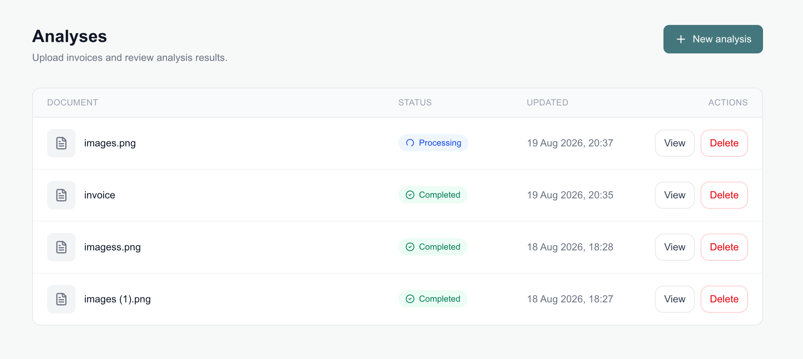
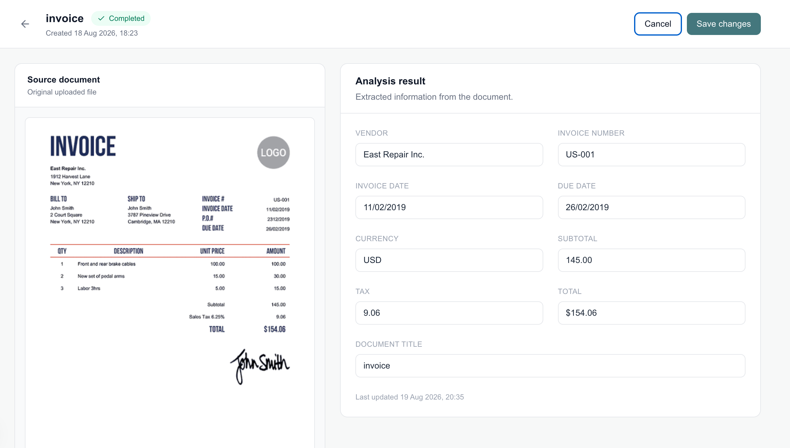

# Invoice Analyzer

A full-stack invoice analysis application built with Next.js, Express, PostgreSQL, and AWS.

Users can upload an invoice image, wait for Amazon Textract to extract its key fields, and then review or edit the result. The original image is stored privately in Amazon S3 and can be previewed alongside the extracted data.

## Features

- Upload PNG and JPEG invoice images
- Store source images in a private S3 bucket
- Extract invoice fields with Textract Expense Analysis
- Track asynchronous jobs with frontend polling
- Preview the original image and extracted result together
- Edit and save the title and extracted fields
- List and delete previous analyses

## How it works

`Upload → S3 → Textract job → Polling → PostgreSQL → Review and edit`

When an image is uploaded, the Express backend stores it in S3 and starts an asynchronous Textract job. Textract returns a job ID, which is saved with a `processing` analysis record.

The frontend then polls the backend. Once Textract finishes, the backend saves the extracted fields to PostgreSQL and changes the status to `completed`. The result is displayed automatically and can be edited by the user.

## Tech stack

- **Frontend:** Next.js 16, React 19, TypeScript, Tailwind CSS
- **Backend:** Express 5, Node.js, TypeScript, Multer
- **Database:** PostgreSQL, Prisma ORM
- **Cloud:** Amazon S3, Amazon Textract

## Screenshots

### Analysis list

### Invoice review and editing

